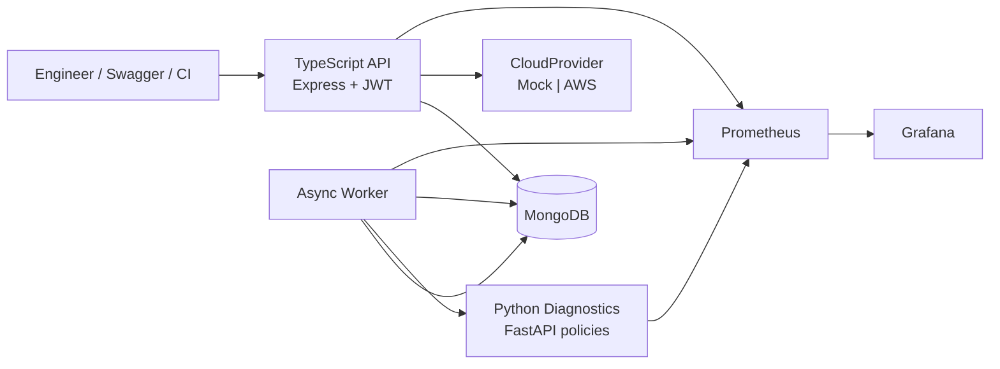

# CloudOps Sentinel — Cloud Operations Automation Platform

Centralized cloud-operations control plane for inventory, asynchronous diagnostics, explainable remediation recommendations, and guarded execution.

This repository is a **production-style portfolio project**. It is fully runnable locally with a mock AWS provider. Real AWS access is optional, credential-chain based, and **read-only by default**. The platform never provisions or mutates real AWS resources unless `ENABLE_AWS_MUTATIONS=true` is set after explicit confirmation.

## Business problem

Platform and SRE teams accumulate cloud drift: untagged resources, public storage, missing alarms, idle compute, and unhealthy services. Investigations are split across consoles, tickets, and ad-hoc scripts. Unsafe automation then becomes the bigger risk — duplicate remediations, missing approvals, and silent mutations.

CloudOps Sentinel gives engineers one workspace-scoped API to:

1. Discover and inventory AWS resources.
2. Run asynchronous health and diagnostic checks.
3. Identify reliability, cost, performance, tagging, and security issues.
4. Generate explainable remediation recommendations from **deterministic operational policies** (not ML).
5. Preview remediation plans in dry-run mode (default).
6. Execute allowlisted actions with approval tokens and idempotency keys.
7. Track job status, failures, retries, and dead-letter state.
8. View operational metrics and an immutable audit trail.

## Key features

- JWT auth with Admin / Operator / Viewer roles and workspace isolation
- Mock AWS provider with seeded, realistic failing resources
- Optional real AWS inventory (EC2, S3, Lambda, CloudWatch) via the default credential chain
- MongoDB-backed job queue with atomic claim, leases, heartbeats, jittered backoff, and DLQ
- FastAPI diagnostics engine with nine documented policy rules
- Circuit breaker and timeouts between the worker and diagnostics
- Prometheus metrics (request rate, p50/p95/p99 latency, queue depth, retries, remediations)
- OpenAPI / Swagger UI at `/docs`
- Docker Compose, Kubernetes manifests, and GitHub Actions CI

## Architecture



### Service responsibilities

| Component | Path | Responsibility |
| --- | --- | --- |
| API | `apps/api` | REST, authz, inventory sync, job intake, remediation safety, audit, metrics |
| Worker | `apps/worker` | Atomic job claim, leases, retries, DLQ, diagnostics fan-out |
| Diagnostics | `services/diagnostics` | Deterministic findings + recommendations |
| Shared | `packages/shared` | Models, providers, job queue, circuit breaker, auth helpers |
| Infra | `infrastructure/` | Docker, Kubernetes, CloudWatch examples |

### Request and asynchronous-job flow

1. Operator calls `POST /api/v1/diagnostics` with an idempotency key.
2. API inserts a `pending` `DiagnosticJob` (or returns the existing job on replay).
3. Worker atomically claims the job (`findOneAndUpdate` + lease).
4. Worker loads workspace resources and POSTs them to `/v1/analyze`.
5. Findings and recommendations are upserted; the job is `completed`, `retry_wait`, or `dead_lettered`.
6. Operator builds a dry-run plan, admin approves (single-use token), operator executes.

## Reliability mechanisms

- Job leases and heartbeats prevent duplicate processing
- Abandoned `running` jobs are recovered when the lease expires
- Exponential backoff with jitter and a max attempt ceiling
- Non-retryable failures skip retry and go to dead-letter
- Job execution timeout
- Diagnostics circuit breaker
- Dependency timeouts on MongoDB and AWS SDK calls
- Graceful shutdown for API and worker
- Structured JSON logs with correlation IDs

## Remediation safety model

- Dry-run is the default
- Real AWS mutations require `ENABLE_AWS_MUTATIONS=true` **and** are still blocked unless you change that flag after explicit confirmation
- Only allowlisted actions execute: add tag, create alarm, enable backup, restart unhealthy service, restrict public storage
- Approval token (hashed at rest), expiry, single use
- Idempotency key prevents duplicate execution
- Workspace ownership is validated on every query
- Before/after state is stored; audit events are immutable

## Local setup

```bash
cp .env.example .env
docker compose up --build
docker compose exec api node dist/seed.js
```

Or: `bash scripts/demo.sh`

Open:

- Swagger: http://localhost:3000/docs/
- Metrics: http://localhost:3000/metrics
- Prometheus: http://localhost:9090
- Grafana: http://localhost:3001 (admin / admin)
- Diagnostics OpenAPI: http://localhost:8000/docs

Demo users (password `CloudOps!demo`):

- `admin@cloudops.local`
- `operator@cloudops.local`
- `viewer@cloudops.local`

The seed command prints JWTs.

### API examples (tested locally)

```bash
export TOKEN="$(curl -s -X POST http://localhost:3000/api/v1/auth/login \
  -H 'Content-Type: application/json' \
  -d '{"email":"admin@cloudops.local","password":"CloudOps!demo"}' \
  | python3 -c 'import sys,json; print(json.load(sys.stdin)["token"])')"

curl -s http://localhost:3000/health/live

curl -s -X POST http://localhost:3000/api/v1/resources/sync \
  -H "Authorization: Bearer $TOKEN" -H 'Content-Type: application/json' -d '{}'

curl -s -X POST http://localhost:3000/api/v1/diagnostics \
  -H "Authorization: Bearer $TOKEN" -H 'Content-Type: application/json' \
  -d '{"idempotencyKey":"demo-job-0001"}'

curl -s "http://localhost:3000/api/v1/jobs?limit=20" \
  -H "Authorization: Bearer $TOKEN"
```

Poll the job until `status=completed`, then:

```bash
curl -s "http://localhost:3000/api/v1/findings?limit=50" -H "Authorization: Bearer $TOKEN"
curl -s "http://localhost:3000/api/v1/recommendations?limit=50" -H "Authorization: Bearer $TOKEN"
```

Create / approve / execute a dry-run plan using IDs from those responses. Sample requests live in `requests/cloudops.http`.

## Testing

Verified locally on 2026-09-03 (Node v22.14.0 compiling to Node 20 Docker images, Python 3.13 locally / 3.12 in Docker):

```bash
npm install
python3 -m pip install -r services/diagnostics/requirements.txt -r services/diagnostics/requirements-dev.txt
npm run lint
npm run format:check
npm run typecheck
npm test
cd services/diagnostics && python3 -m pytest -q
```

Results:

- ESLint: pass (`--max-warnings=0`)
- Prettier: pass
- TypeScript: pass across `@cloudops/shared`, `@cloudops/api`, `@cloudops/worker`
- Jest: 25 tests passed (API 10, worker 2, shared 13)
- Pytest: 7 passed
- Docker images for API, worker, and diagnostics built successfully
- Compose demo: 13 mock resources, diagnostic job completed with 21 findings / 21 recommendations, dry-run remediation `succeeded`

Load test (optional, stack must be up):

```bash
k6 run load-tests/k6-health.js
# or
artillery run load-tests/artillery.yml
```

## Observability

- Pino JSON logs with redaction of secrets
- `x-correlation-id` on every response
- Prometheus histograms for HTTP and job duration (p50/p95/p99 via `histogram_quantile`)
- Grafana dashboard JSON in `monitoring/grafana/dashboards`
- CloudWatch dashboard and alarm examples in `infrastructure/aws`
- Sample Insights queries in `monitoring/log-queries`
- Runbook: `docs/operational-runbook.md`

## AWS deployment approach

Real AWS is **not** required for the demo.

To inventory a real account (read-only):

1. Export credentials via the standard AWS chain (`AWS_PROFILE`, instance role, or env vars). Never put keys in git.
2. Set `CLOUD_PROVIDER=aws` and `AWS_REGION`.
3. Keep `AWS_READ_ONLY=true` and `ENABLE_AWS_MUTATIONS=false`.
4. Confirm the IAM principal can call `ec2:Describe*`, `s3:List*`, `s3:Get*`, `lambda:List*`, `lambda:Get*`, `cloudwatch:List*`, `cloudwatch:Get*`.

Do not deploy this project to a paid AWS account or enable mutations without an explicit, separate confirmation.

Optional LocalStack: `docker compose -f docker-compose.yml -f docker-compose.localstack.yml up` and set `AWS_ENDPOINT_URL=http://localstack:4566`.

## Engineering trade-offs

- **MongoDB as the job queue** instead of SQS/Kafka keeps the local demo one-command and still demonstrates atomic claim, leases, and DLQ semantics.
- **Deterministic policies** instead of a classifier: findings are explainable and testable, which is what production SRE automation actually needs first.
- **Simulated remediations** by default: a portfolio project must not mutate someone else's cloud.
- **npm workspaces + a separate Python service** mirrors a realistic polyglot platform without a heavy Bazel/Nx setup.

## Known limitations

- Mock provider data is static until you re-seed or run simulated remediations.
- Real AWS inventory is a bounded first page (not a full account crawler).
- Approval tokens are shown once in the API response; there is no out-of-band channel.
- Grafana/Prometheus are Compose-only; Kubernetes manifests cover the app services, not a full observability stack.
- Node 22 works locally; Docker images pin Node 20 as specified.

## Future enhancements

- Multi-region fan-out and AWS Organizations support
- Change calendar / maintenance-window gates
- Human-in-the-loop chatops approvals
- Persistent job outbox to SQS for multi-cluster workers
- Policy-as-code packs per environment

## Suggested README screenshots

1. Swagger UI at `/docs` showing the diagnostics and remediations groups
2. Grafana **CloudOps Sentinel** dashboard with request rate and p95 latency
3. A completed job JSON with `resultSummary.findingsCreated > 0`
4. A dry-run execution payload with `beforeState` / `afterState`
5. Prometheus graph of `worker_queue_depth`

## License

MIT
