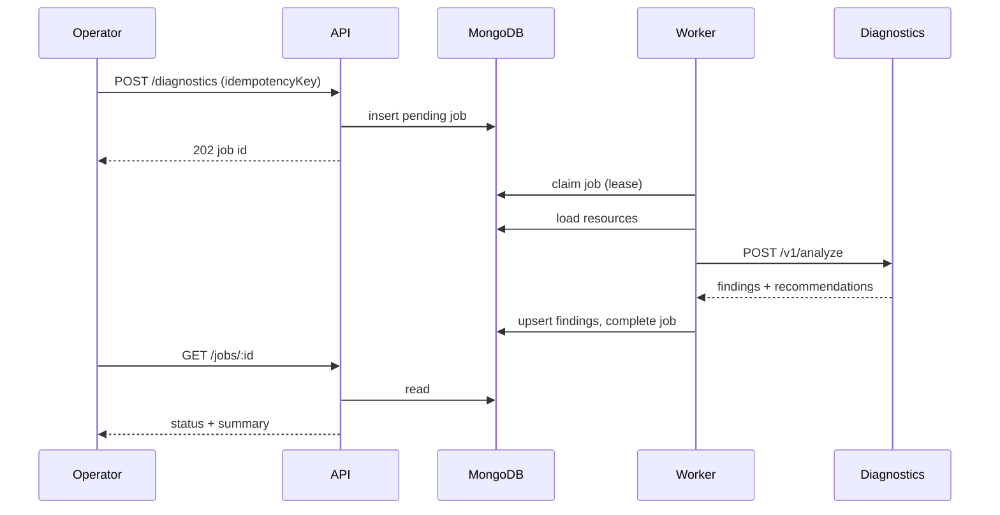

# Architecture

## Runtime topology

Three processes share one MongoDB database:

- **API** is the synchronous edge. It authenticates JWTs, validates Zod payloads, writes jobs and plans, and never executes long diagnostics inline.
- **Worker** is the asynchronous control loop. It claims jobs with an atomic MongoDB update, holds a lease, heartbeats, and writes findings.
- **Diagnostics** is a side-effect-free policy engine. It receives normalized resource documents and returns findings plus recommendations.

## Data model highlights

Every operational record is workspace-scoped. Unique indexes enforce idempotency for jobs, plans, and executions. Audit events have an immutable `createdAt` and no updates.

## Failure domains

| Failure | Behavior |
| --- | --- |
| Diagnostics timeout | Retryable job failure, backoff, then DLQ |
| Diagnostics 5xx burst | Circuit breaker opens; jobs retry |
| Worker crash mid-job | Lease expires; another worker reclaims |
| Duplicate client retry | Same idempotency key returns original record |
| Cross-tenant id | 404, not 403, for missing workspace documents |

## Provider abstraction

`CloudProvider` has two implementations. `MockAwsProvider` is the default and is sufficient for every demo path. `AwsProvider` uses AWS SDK v3 with `maxAttempts`, per-call timeouts, and throttle classification. It issues only read APIs.
